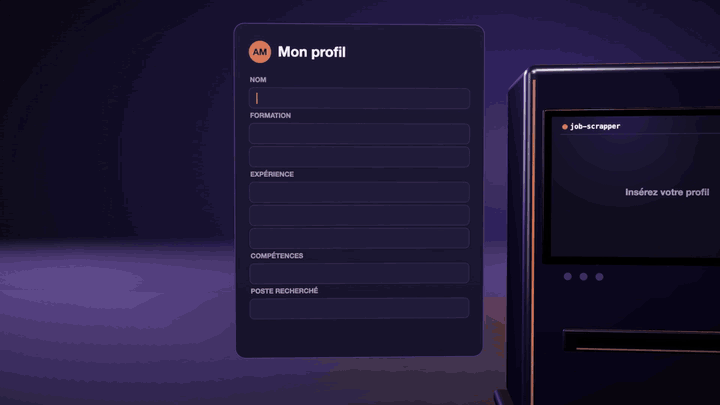

# Job scrapper

<p align="center"><a href="README.md">English</a> · <b>Français</b></p>

[](https://github.com/Iliesseu28/job-scrapper/actions/workflows/test.yml)

Votre propre radar de recherche d'emploi, pensé pour les francophones. Il lit les offres d'emploi de **32 sources** au plus (API officielles, pages carrières des entreprises, sites d'emploi, flux), écarte ce qui ne colle manifestement pas grâce à **vos règles**, puis demande à **un LLM de noter le reste au regard de votre profil**, avec un court résumé « en vrai, c'est quoi ce poste », ainsi que les points forts et les points faibles des meilleures offres. Vous parcourez les résultats dans une petite page web locale.

Vous l'adaptez en modifiant **un dossier, `profile/`, et un fichier, `.env`**. Aucun code à changer.

<p align="center"><a href="docs/demo-fr.mp4"></a><br><sub>Cliquez pour la vidéo en pleine qualité, avec le son</sub></p>


*La page de consultation locale (offres d'exemple, toutes fictives).*

> **Pensé pour les francophones.** 20 des 32 sources couvrent le marché de l'emploi francophone : la France (12 sources, dont France Travail, l'APEC, Welcome to the Jungle, HelloWork et le catalogue VIE), la Belgique, la Suisse romande, le Luxembourg, le Québec et le Canada, le Maroc, l'Algérie, la Tunisie, le Sénégal et la Côte d'Ivoire. Le filtre reconnaît les annonces rédigées en français ou en anglais. Les 12 autres couvrent le monde entier (pages carrières des entreprises, Adzuna dans 19 pays, Jooble dans 70, sites d'emploi en télétravail, flux) ou d'autres pays (Suisse alémanique, Singapour, Malaisie, Chine) : l'outil fonctionne donc aussi hors de cette zone, avec moins de sources.
>
> 🇬🇧 *This page is also available [in English](README.md).*

<p align="center"></p>

```
                ┌──────────────── profile/ (you) ────────────────┐
                │ criteria · titles · sources · companies · CV   │
                └───────┬───────────────┬───────────────┬────────┘
                        ▼               ▼               ▼
 32 sources ──► scraping/ ──► scoring/filter ──► scoring/score (LLM) ──► data/*.json ──► viewer/
               collect new     free, instant       0-5 score, verdict,                   review, save,
               offers only     rules               summary, pros/cons                    mark applied
```

- **Local.** Les offres sont stockées en JSON dans `data/`. Pas de base de données, pas de compte, pas de serveur.
- **Économique.** Seules les offres qui passent vos règles arrivent jusqu'à l'IA. Une même offre présente sur plusieurs sources n'est notée qu'une fois. Les offres partent par lots, avec un début de prompt qui peut être mis en cache. Un passage quotidien classique avec Gemini Flash coûte quelques centimes.
- **Incrémental.** Chaque source ne lit que ce qui a été publié depuis le dernier passage (plus une marge de 2 jours).
- **Une seule dépendance** (`js-yaml`). Node 20 ou plus.

---

## Démarrage rapide

```bash
git clone <this repo> job-scrapper && cd job-scrapper
npm install
cp .env.example .env        # puis mettez-y une clé d'IA (Gemini a une offre gratuite)
```

1. Modifiez les fichiers de `profile/` (le profil d'exemple est un « ingénieur IA / automatisation » fictif : remplacez-le). Voir [Votre profil](#votre-profil).
2. Vérifiez que tout est en ordre :
   ```bash
   npm run check      # profil et .env valides, fournisseur d'IA trouvé
   npm run sources    # quelles sources vont tourner, lesquelles sont ignorées et pourquoi
   ```
3. Premier passage sans IA, pour voir ce que vos règles gardent :
   ```bash
   npm run collect -- --days 7
   ```
4. Notez et regardez :
   ```bash
   npm run scan       # collecte → filtre → détails → note de l'IA
   npm run view       # http://localhost:4321
   ```

Lancez `npm run scan` une fois par jour (cron, Planificateur de tâches Windows, launchd…).

Avec [Claude Code](https://claude.com/claude-code) : ouvrez le dossier et demandez *« configure-le pour moi »* en collant votre CV. Le skill `setup-profile` et l'agent `profile-coach` écrivent `profile/` à votre place. Voir [Claude Code](#claude-code).

---

## Commandes

| Commande | Ce qu'elle fait | Coût en IA |
|---|---|---|
| `npm run scan` | le passage quotidien : collecte → filtre → récupération des descriptions manquantes → notation | oui |
| `npm run collect` | collecte + filtre seulement | aucun |
| `npm run filter` | réapplique le filtre à toutes les offres stockées (après une modification du profil), affiche combien chaque règle en a écarté | aucun |
| `npm run score` | note les offres gardées qui n'ont pas encore de note | oui |
| `npm run sources` | toutes les sources, et si elles vont tourner chez vous | aucun |
| `npm run check` | valide `profile/` et `.env` | aucun |
| `npm run stats` | totaux de ce qui est stocké | aucun |
| `npm run view` | page de consultation locale sur http://localhost:4321 | aucun |
| `npm test` | tests (hors ligne) | aucun |

Options (après `--`) : `--source wttj,apec` (seulement ces sources), `--days 14` (impose la fenêtre de collecte), `--limit 30` (note au plus N offres), `--rescore` (note à nouveau des offres déjà notées), `--keys k1,k2` (note seulement ces offres).

---

## Organisation du dépôt

```
profile/      VOUS : votre profil, vos règles, vos sources et vos entreprises cibles (YAML + Markdown)
scraping/     la collecte : un collecteur par source, le registre, la fenêtre incrémentale
scoring/      le filtre déterministe, l'analyse des salaires, le client LLM et la notation par l'IA
pipeline/     ligne de commande, chargement et validation de la configuration, stockage JSON local
viewer/       page web locale pour trier les offres (sans build, sans dépendance)
.claude/      agents, skills et hooks Claude Code de ce projet
tests/        node:test, sans réseau
data/         créé au premier passage : vos offres, vos passages et vos décisions (ignoré par git)
```

---

## Votre profil

Tout ce qui vous concerne vit dans `profile/`. Le pipeline le valide à chaque passage (`npm run check` affiche les erreurs avec le fichier et la clé).

| Fichier | Ce qu'on y met |
|---|---|
| `profile.md` | Qui vous êtes, avec des mots simples : parcours, points forts, ce que vous voulez, ce que vous refusez. **Envoyé à l'IA** avec chaque lot : ni téléphone, ni e-mail, ni adresse. |
| `scoring-rules.md` | L'échelle (0 à 5) et les règles que l'IA applique : plafonds selon l'ancienneté, les langues, le lieu, le salaire… Adaptez les exemples à votre situation. |
| `criteria.yaml` | Les règles strictes appliquées **avant** l'IA : fraîcheur, lieu, contrats, ancienneté, langues, sujets indésirables, mots prioritaires, et les réglages de coût de l'IA. |
| `titles.yaml` | Les recherches envoyées aux sources, et les intitulés de poste que vous voulez, que vous acceptez sous conditions, ou que vous ne voulez jamais. |
| `sources.yaml` | Les sources activées, et leurs réglages (pays, recherches, pages…). |
| `companies.yaml` | Les entreprises dont les pages carrières sont lues directement (Ashby, Greenhouse, Lever, SmartRecruiters, Workable, Recruitee, Teamtailor, WelcomeKit). |

Le filtre fonctionne dans cet ordre (`scoring/filter.mjs`) : contrats → ancienneté dans l'intitulé → langues exigées / langue de l'annonce → fraîcheur → intitulés indésirables → signaux de domaine (le poste doit être dans votre domaine) → sujets « principalement axé sur » → lieu → priorité. Chaque offre écartée garde sa raison : `npm run filter` vous dit donc précisément quelle règle a écarté quoi.

Les motifs sont des expressions régulières insensibles à la casse, et les accents sont ignorés des deux côtés. En YAML, écrivez `"\\bai\\b"` (guillemets doubles, barre oblique inverse doublée) ou `'\bai\b'`. Une liste vide désactive une règle. Dans le doute, gardez : une offre gardée à tort coûte une fraction de centime, une offre écartée à tort est perdue.

---

## Sources

Une source tourne quand elle figure sous `enabled` dans `profile/sources.yaml` **et** que ses clés (s'il en faut) sont dans `.env`. Une source sans sa clé est ignorée avec un message : rien ne casse. `npm run sources` affiche ce tableau pour votre configuration.

**La couverture en un coup d'œil**

| Zone | Sources |
|---|---|
| France (12) | `france_travail`, `apec`, `wttj`, `stationf`, `welcomekit`, `hellowork`, `free_work`, `jobteaser`, `lesjeudis`, `vie`, `engagement_jeunes`, `vie_entreprises` |
| Autres marchés francophones (8) | `talent` (BE, CH, LU, MA, TN, SN, CI), `jobs_lu` (Luxembourg), `jobup_ch` (Suisse romande), `espresso_jobs` (Québec), `jobbank_canada`, `rekrute` (Maroc), `emploitic` (Algérie), `emploidakar` (Sénégal) |
| Monde entier et autres pays (12) | `ats`, `rss`, `boards`, `aijobs`, `adzuna`, `jooble`, `fantastic_jobs`, `jobroom_ch`, `jobscout24`, `mycareersfuture`, `hiredly`, `zhaopin` |

**Types** : `api` : API publique officielle · `ats` : API des pages carrières des entreprises · `feed` : RSS / listes JSON publiques · `site-api` : l'adresse de recherche JSON qu'utilisent les pages du site d'emploi lui-même · `html` : lit les pages du site.

| id | Source | Couverture | Type | Clés (`.env`) | Remarques |
|---|---|---|---|---|---|
| `ats` | Pages carrières des entreprises | Monde entier | ats | aucune | Ashby, Greenhouse, Lever, SmartRecruiters, Workable, Recruitee, Teamtailor, WelcomeKit. Entreprises dans `companies.yaml`. En général les offres les plus fraîches. |
| `rss` | Flux RSS / Atom | Tous | feed | aucune | N'importe quel flux sous `rss.feeds`. |
| `boards` | Sites d'emploi en télétravail (Arbeitnow, Remotive, Himalayas, RemoteOK…) | Télétravail / Europe | feed | aucune | N'importe quel site qui renvoie une liste JSON, sous `boards.list`. |
| `aijobs` | artificialintelligencejobs.co | Europe | feed | aucune | Site consacré à l'IA uniquement. |
| `adzuna` | Adzuna | 19 pays | api | `ADZUNA_APP_ID`, `ADZUNA_APP_KEY` | Clé gratuite : developer.adzuna.com. Pays dans `adzuna.countries`. |
| `france_travail` | France Travail (ex Pôle emploi) | France | api | `FRANCE_TRAVAIL_ID`, `FRANCE_TRAVAIL_SECRET` | Clé gratuite : francetravail.io, API « Offres d'emploi v2 ». |
| `jooble` | Jooble | 70 pays | api | `JOOBLE_API_KEY` | Clé gratuite : jooble.org/api/about. Recherches dans `jooble.searches`. |
| `mycareersfuture` | MyCareersFuture | Singapour | api | aucune | API du portail officiel du gouvernement. |
| `jobroom_ch` | Job-Room (service public de l'emploi suisse) | Suisse | api | aucune | API publique officielle. |
| `fantastic_jobs` | Fantastic Jobs (agrégateur LinkedIn + ATS) | Monde entier | api | `FANTASTIC_JOBS_API_KEY` | Payant, essai gratuit. Le moyen légal, ici, d'obtenir les offres LinkedIn. `callsPerRun` plafonne la dépense. |
| `wttj` | Welcome to the Jungle | France, Europe | site-api | `WTTJ_APP_ID`, `WTTJ_API_KEY` | Index de recherche du site (voir [clés des sites](#clés-des-sites)). |
| `stationf` | Job board de Station F | France (startups) | site-api | `STATIONF_ALGOLIA_APP_ID`, `STATIONF_ALGOLIA_KEY` | Index de recherche derrière jobs.stationf.co (voir [clés des sites](#clés-des-sites)). |
| `welcomekit` | Sites carrières WelcomeKit | France | site-api | aucune | Organisations dans `welcomekit.organizations`. |
| `apec` | APEC | France (cadres et ingénieurs) | site-api | aucune | Adresse de recherche d'apec.fr. |
| `vie` | Catalogue VIE de Business France | Monde entier (contrats VIE français) | site-api | `VIE_API_KEY` | Tout le catalogue VIE officiel (voir [clés des sites](#clés-des-sites)). |
| `hellowork` | HelloWork | France | html | aucune | Descriptions complètes récupérées lors de la passe de détails. |
| `free_work` | Free-Work | France (tech, CDI et freelance) | html | aucune | Une requête par offre ; une offre stockée n'est jamais récupérée deux fois. |
| `espresso_jobs` | Espresso-Jobs | Québec | html | aucune | Salaire en CAD. |
| `talent` | Talent.com | FR, BE, CH, LU, MA, TN, SN, CI | html | aucune | Un domaine par pays (`talent.domains`). |
| `jobteaser` | JobTeaser | France (jeunes diplômés) | html | aucune | Répond souvent 403 aux scripts. |
| `lesjeudis` | LesJeudis | France (tech) | html | aucune | |
| `jobs_lu` | jobs.lu | Luxembourg | html | aucune | |
| `jobscout24` | JobScout24 | Suisse | html | aucune | |
| `jobup_ch` | jobup.ch | Suisse (romande) | html | aucune | |
| `jobbank_canada` | Guichet-Emplois (gouvernement du Canada) | Canada | html | aucune | |
| `rekrute` | ReKrute | Maroc | html | aucune | |
| `emploitic` | Emploitic | Algérie | html | aucune | |
| `emploidakar` | EmploiDakar | Sénégal | html | aucune | |
| `hiredly` | Hiredly | Malaisie | html | aucune | Catégories informatique et ingénierie. |
| `zhaopin` | Zhaopin | Chine | html | aucune | Recherches en mandarin dans `zhaopin.queries`. |
| `engagement_jeunes` | Engagement Jeunes (offres VIE) | Monde entier (VIE français) | html | aucune | |
| `vie_entreprises` | Sites carrières des grands groupes (SuccessFactors, Radancy, Avature…) | Monde entier | html | aucune | Les sites propres des grands groupes, interrogés pour leurs offres VIE. Certains interdisent les pages de recherche dans leur robots.txt : lisez-le d'abord. |

**Non inclus :** les pages LinkedIn et Indeed (leurs conditions d'utilisation interdisent le scraping ; utilisez `fantastic_jobs` pour les offres LinkedIn). Pour ajouter une source : voir le skill `add-source`, ou [Contribuer](#contribuer).

### Clés des sites

`wttj`, `stationf` et `vie` utilisent les clés de recherche que les pages web de ces sites envoient elles-mêmes au navigateur de chaque visiteur (recherche seulement, publiques par conception). Pour les obtenir : ouvrez le site, Outils de développement → Réseau, trouvez la requête vers `algolia` (ou l'en-tête `X-API-KEY` sur mon-vie-via.businessfrance.fr), copiez les valeurs dans `.env`. Elles changent de temps en temps ; quand une source se met à renvoyer 401/403, récupérez-les à nouveau.

---

## Comment fonctionne la notation par l'IA

`scoring/score.mjs`, indépendant du fournisseur (`scoring/llm.mjs`).

1. **File d'attente.** Les offres gardées sans note, pas plus anciennes que `scoring.maxAgeDays`, les plus prioritaires d'abord, au plus `scoring.maxPerRun` par passage. Une même offre trouvée sur plusieurs sources (même entreprise + intitulé + ville) n'est envoyée qu'une fois ; la note est recopiée sur ses jumelles.
2. **Lots.** Les offres partent par `batchSize` (12). Les offres d'une même entreprise avec le même intitulé sont regroupées en une seule. Le prompt système (`profile.md` + `scoring-rules.md` + format de sortie) ne change jamais d'un lot à l'autre : les fournisseurs qui mettent le prompt en cache ne le facturent donc qu'une fois.
3. **Sortie.** Pour chaque offre : `score` de 0 à 5, `verdict` (`apply` / `maybe` / `no`), une `reason` en une ligne, `company_type` (`startup`, `scaleup`, `sme`, `large_company`, `public_sector`, `nonprofit`, `unknown`) et `employer_type` (`direct`, `consulting`, `staffing`, `unknown`). Seules les offres au niveau de `detailsThreshold` ou au-dessus reçoivent aussi un `summary` du quotidien du poste, des `pros` et des `cons` : personne ne lit le détail d'une offre notée 1,5.
4. **Stratégie.** `single-pass` (par défaut) note et rédige les détails en un seul appel ; `two-pass` note tout d'abord, puis rédige les détails pour les meilleures seulement.

| `AI_PROVIDER` | Modèle par défaut | Remarques |
|---|---|---|
| `gemini` | gemini-2.5-flash | Offre gratuite sur aistudio.google.com. Sortie structurée, cache implicite. |
| `anthropic` | claude-haiku-4-5 | Cache de prompt explicite. |
| `openai` | gpt-4.1-mini | |
| `mistral` | mistral-small-latest | |
| `groq` | llama-3.3-70b-versatile | Compatible OpenAI. |
| `deepseek` | deepseek-chat | Compatible OpenAI. |
| `openrouter` | google/gemini-2.5-flash | Tout modèle proposé par OpenRouter. |
| `ollama` | llama3.1 | Modèles locaux, sans coût ; la qualité dépend du modèle. |
| `custom` | aucun (définissez `AI_MODEL`, `AI_BASE_URL`) | N'importe quelle adresse compatible OpenAI. |

Chaque passage affiche les tokens utilisés (et mis en cache) et les enregistre dans `data/runs.json`.

---

## La page de consultation

`npm run view` → http://localhost:4321 (port : `VIEWER_PORT`). N'écoute que sur 127.0.0.1.

Onglets *To review / Saved / Applied / Hidden / All* (à trier, gardées, candidatures envoyées, masquées, toutes), filtres (recherche de texte, note minimale, verdict, type d'entreprise, type d'employeur, source) et tri (meilleure note ou plus récentes), et pour chaque offre sa note, la raison donnée par l'IA, le résumé, les points forts et les points faibles. Clavier : `j`/`k` pour se déplacer, `s` garder, `a` candidature envoyée, `h` masquer, `o` ou Entrée pour ouvrir l'offre, `/` rechercher. Vos décisions sont stockées dans `data/decisions.json`.

---

## Claude Code

Le dépôt contient un dossier `.claude/` pour que [Claude Code](https://claude.com/claude-code) sache comment travailler avec lui (`CLAUDE.md` contient les notes du projet).

| | Nom | Ce qu'il fait |
|---|---|---|
| Skill | `setup-profile` | D'un clone tout neuf aux premières offres notées : installation, `.env`, profil, premier passage. |
| Skill | `run-scan` | Lance le passage quotidien et résume les nouvelles offres qui valent une candidature. |
| Skill | `add-source` | Ajoute une source dans les règles : collecteur, registre, réglages, test, ligne du README. |
| Skill | `tune-scoring` | Ajuste la façon dont l'IA note (règles, profil, réglages de coût, modèle). |
| Agent | `profile-coach` | Écrit `profile/` à partir de votre CV ou d'une description de ce que vous voulez. |
| Agent | `source-doctor` | Diagnostique et répare une source qui plante ou ne renvoie rien. |
| Agent | `filter-tuner` | Lit ce que le filtre et l'IA ont gardé ou écarté, et propose des modifications précises du profil. |
| Hook | `protect-secrets` | Bloque la lecture de `.env` et l'écriture dans le dépôt de tout ce qui ressemble à une clé d'API. |
| Hook | `check-after-edit` | Valide `profile/` après chaque modification ; lance les tests après une modification du code. |

---

## Utilisation responsable

- Les offres appartiennent aux sites et aux entreprises qui les publient. Servez-vous de cet outil pour **votre propre recherche d'emploi**, pas pour republier des offres.
- Préférez les API officielles (`api`, `ats`, `feed`). Les sources de type `html` sont **désactivées dans le profil d'exemple** : lisez les conditions d'utilisation et le `robots.txt` de chaque site avant d'en activer une.
- Les collecteurs sont polis par conception : ils ne lisent que les nouvelles offres, plafonnent le nombre de pages, marquent une pause entre les requêtes et n'essaient jamais de contourner une protection anti-robots (Cloudflare, DataDome, captchas). Une source qui se met à bloquer les scripts doit être désactivée, pas « réparée ».
- `profile/profile.md` et le texte des offres sont envoyés au fournisseur d'IA que vous choisissez. Prenez-en un dont la politique de données vous convient, ou utilisez `ollama` pour tout garder sur votre machine.
- Les sites changent : un collecteur peut casser à tout moment. `source-doctor` ou une issue vous aidera.

---

## Contribuer

Les issues et les pull requests sont les bienvenues, en particulier pour de nouvelles sources et pour réparer celles qui sont cassées. Une nouvelle source demande son collecteur dans `scraping/sources/`, un export dans `scraping/sources/index.mjs`, une entrée dans `scraping/registry.mjs`, ses clés dans `.env.example`, un test avec un petit jeu de données dans `tests/sources/`, et une ligne dans le tableau du [README anglais](README.md#sources). `npm test` doit passer (il vérifie que chaque source y est documentée).

Les collecteurs les plus anciens gardent des commentaires et des noms de paramètres en français (le projet a commencé comme une recherche d'emploi en France) ; le nouveau code est en anglais.

## Licence

[MIT](LICENSE)
