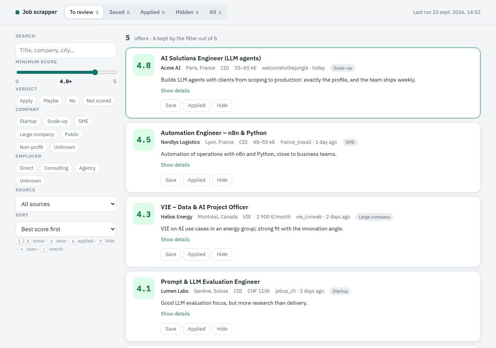
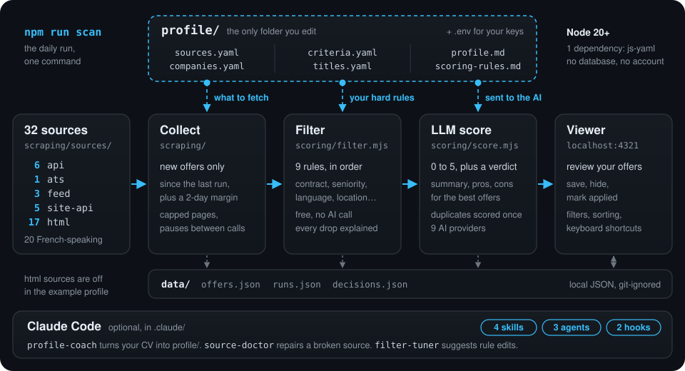

# Job scrapper

[](https://github.com/Iliesseu28/job-scrapper/actions/workflows/test.yml)

Your own job-search radar, built for French-speaking job seekers. It reads job offers from up to **32 sources** (official APIs, company career pages, job boards, feeds), throws away what obviously doesn't fit with **your rules**, and asks an **LLM to score the rest against your profile** — with a short "what is this job, really" summary, pros and cons for the best ones. You go through the results in a small local web page.

You adapt it by editing **one folder, `profile/`, and one file, `.env`**. No code to change.



*The local viewer (example offers, all fictional).*

> **Built for French-speaking job seekers.** 20 of the 32 sources cover the French-speaking job market: France (12 sources, including France Travail, APEC, Welcome to the Jungle, HelloWork and the VIE catalogue), Belgium, Switzerland (Romandy), Luxembourg, Québec and Canada, Morocco, Algeria, Tunisia, Senegal and Côte d'Ivoire. The filter recognises ads written in French or English. The other 12 cover the world (company career pages, Adzuna in 19 countries, Jooble in 70, remote boards, feeds) or other countries (German-speaking Switzerland, Singapore, Malaysia, China), so the tool still works outside that area, with fewer sources.
>
> 🇫🇷 *Pensé pour les francophones : 20 des 32 sources couvrent la France et les pays francophones. La documentation est en anglais, mais le profil (`profile/`) s'écrit dans la langue de votre choix.*

<p align="center"></p>

```
                ┌──────────────── profile/ (you) ────────────────┐
                │ criteria · titles · sources · companies · CV   │
                └───────┬───────────────┬───────────────┬────────┘
                        ▼               ▼               ▼
 32 sources ──► scraping/ ──► scoring/filter ──► scoring/score (LLM) ──► data/*.json ──► viewer/
               collect new     free, instant       0–5 score, verdict,                   review, save,
               offers only     rules               summary, pros/cons                    mark applied
```

- **Local.** Offers are stored as JSON in `data/`. No database, no account, no server.
- **Cheap.** Only offers that pass your rules reach the AI. Duplicates across sources are scored once. Offers are sent in batches with a cacheable prompt prefix. A typical daily run with Gemini Flash costs a few cents.
- **Incremental.** Each source only reads what was published since the last run (plus a 2-day margin).
- **One dependency** (`js-yaml`). Node 20+.

---

## Quick start

```bash
git clone <this repo> job-scrapper && cd job-scrapper
npm install
cp .env.example .env        # then put an AI key in it (Gemini has a free tier)
```

1. Edit the files in `profile/` (the example profile is a fictional "AI / automation engineer" — replace it). See [Your profile](#your-profile).
2. Check everything:
   ```bash
   npm run check      # profile and .env are valid, AI provider found
   npm run sources    # which sources will run, which are skipped and why
   ```
3. First run without AI, to see what your rules keep:
   ```bash
   npm run collect -- --days 7
   ```
4. Score and look:
   ```bash
   npm run scan       # collect → filter → details → AI score
   npm run view       # http://localhost:4321
   ```

Run `npm run scan` once a day (cron, Windows Task Scheduler, launchd…).

With [Claude Code](https://claude.com/claude-code): open the folder and ask *"set this up for me"* with your CV pasted — the `setup-profile` skill and the `profile-coach` agent write `profile/` for you. See [Claude Code](#claude-code).

---

## Commands

| Command | What it does | AI cost |
|---|---|---|
| `npm run scan` | the daily run: collect → filter → fetch missing descriptions → score | yes |
| `npm run collect` | collect + filter only | none |
| `npm run filter` | re-apply the filter to every stored offer (after editing your profile), prints how many each rule rejected | none |
| `npm run score` | score kept offers that have no score yet | yes |
| `npm run sources` | every source, and whether it will run for you | none |
| `npm run check` | validate `profile/` and `.env` | none |
| `npm run stats` | totals of what is stored | none |
| `npm run view` | local review page on http://localhost:4321 | none |
| `npm test` | tests (offline) | none |

Options (after `--`): `--source wttj,apec` (only these sources), `--days 14` (force the collection window), `--limit 30` (score at most N), `--rescore` (score again offers already scored), `--keys k1,k2` (score these offers only).

---

## Layout

```
profile/      YOU — your profile, rules, sources and target companies (YAML + Markdown)
scraping/     collection: one collector per source, the registry, the incremental window
scoring/      the deterministic filter, the salary parser, the LLM client and the AI scoring
pipeline/     command line, config loading and validation, local JSON store
viewer/       local web page to review offers (no build, no dependency)
.claude/      Claude Code agents, skills and hooks for this project
tests/        node:test, no network
data/         created on first run — your offers, runs and decisions (git-ignored)
```

---

## Your profile

Everything about *you* lives in `profile/`. The pipeline validates it on every run (`npm run check` shows errors with the file and the key).

| File | What goes in it |
|---|---|
| `profile.md` | Who you are, in plain words: background, strengths, what you want, what you refuse. **Sent to the AI** with every batch — no phone, email or address. |
| `scoring-rules.md` | The scale (0–5) and the rules the AI applies: caps for seniority, languages, location, pay… Adapt the examples to your situation. |
| `criteria.yaml` | Hard rules applied **before** the AI: freshness, location, contracts, seniority, languages, unwanted topics, priority words, and the AI cost settings. |
| `titles.yaml` | Search queries sent to the sources, and the job titles you want / accept under conditions / never want. |
| `sources.yaml` | Which sources are enabled, and their settings (countries, queries, pages…). |
| `companies.yaml` | Companies whose career pages are read directly (Ashby, Greenhouse, Lever, SmartRecruiters, Workable, Recruitee, Teamtailor, WelcomeKit). |

How the filter works, in order (`scoring/filter.mjs`): contracts → seniority in the title → required languages / ad language → freshness → unwanted titles → domain signals (the job must be in your field) → "mainly about" topics → location → priority. Each rejected offer keeps its reason, so `npm run filter` tells you exactly which rule dropped what.

Patterns are case-insensitive regular expressions, and accents are ignored on both sides. In YAML, write `"\\bai\\b"` (double quotes, backslash doubled) or `'\bai\b'`. An empty list switches a rule off. When in doubt, keep: a wrongly kept offer costs a fraction of a cent, a wrongly rejected one is gone.

---

## Sources

A source runs when it is listed under `enabled` in `profile/sources.yaml` **and** its keys (if any) are in `.env`. A source without its key is skipped with a message — nothing breaks. `npm run sources` prints this table for your setup.

**Coverage at a glance**

| Area | Sources |
|---|---|
| France (12) | `france_travail`, `apec`, `wttj`, `stationf`, `welcomekit`, `hellowork`, `free_work`, `jobteaser`, `lesjeudis`, `vie`, `engagement_jeunes`, `vie_entreprises` |
| Other French-speaking markets (8) | `talent` (BE, CH, LU, MA, TN, SN, CI), `jobs_lu` (Luxembourg), `jobup_ch` (Romandy), `espresso_jobs` (Québec), `jobbank_canada`, `rekrute` (Morocco), `emploitic` (Algeria), `emploidakar` (Senegal) |
| Worldwide and other countries (12) | `ats`, `rss`, `boards`, `aijobs`, `adzuna`, `jooble`, `fantastic_jobs`, `jobroom_ch`, `jobscout24`, `mycareersfuture`, `hiredly`, `zhaopin` |

**Kinds** — `api`: official public API · `ats`: companies' career-page APIs · `feed`: RSS / public JSON lists · `site-api`: the JSON search endpoint a job site's own pages use · `html`: reads the site's pages.

| id | Source | Coverage | Kind | Keys (`.env`) | Notes |
|---|---|---|---|---|---|
| `ats` | Company career pages | Worldwide | ats | — | Ashby, Greenhouse, Lever, SmartRecruiters, Workable, Recruitee, Teamtailor, WelcomeKit. Companies in `companies.yaml`. Usually the freshest offers. |
| `rss` | RSS / Atom feeds | Any | feed | — | Any feed under `rss.feeds`. |
| `boards` | Remote job boards (Arbeitnow, Remotive, Himalayas, RemoteOK…) | Remote / Europe | feed | — | Any board returning a JSON list, under `boards.list`. |
| `aijobs` | artificialintelligencejobs.co | Europe | feed | — | AI-only board. |
| `adzuna` | Adzuna | 19 countries | api | `ADZUNA_APP_ID`, `ADZUNA_APP_KEY` | Free key: developer.adzuna.com. Countries in `adzuna.countries`. |
| `france_travail` | France Travail (ex Pôle emploi) | France | api | `FRANCE_TRAVAIL_ID`, `FRANCE_TRAVAIL_SECRET` | Free key: francetravail.io, API "Offres d'emploi v2". |
| `jooble` | Jooble | 70 countries | api | `JOOBLE_API_KEY` | Free key: jooble.org/api/about. Searches in `jooble.searches`. |
| `mycareersfuture` | MyCareersFuture | Singapore | api | — | Official government portal API. |
| `jobroom_ch` | Job-Room (Swiss public employment service) | Switzerland | api | — | Official public API. |
| `fantastic_jobs` | Fantastic Jobs (LinkedIn + ATS aggregator) | Worldwide | api | `FANTASTIC_JOBS_API_KEY` | Paid, free trial. The lawful way here to get LinkedIn offers. `callsPerRun` caps spending. |
| `wttj` | Welcome to the Jungle | France, Europe | site-api | `WTTJ_APP_ID`, `WTTJ_API_KEY` | Search index of the site (see [site keys](#site-keys)). |
| `stationf` | Station F job board | France (startups) | site-api | `STATIONF_ALGOLIA_APP_ID`, `STATIONF_ALGOLIA_KEY` | Search index behind jobs.stationf.co (see [site keys](#site-keys)). |
| `welcomekit` | WelcomeKit career sites | France | site-api | — | Organisations in `welcomekit.organizations`. |
| `apec` | APEC | France (managers & engineers) | site-api | — | Search endpoint of apec.fr. |
| `vie` | Business France VIE catalogue | Worldwide (French VIE contracts) | site-api | `VIE_API_KEY` | Whole official VIE catalogue (see [site keys](#site-keys)). |
| `hellowork` | HelloWork | France | html | — | Full descriptions fetched in the details pass. |
| `free_work` | Free-Work | France (tech, permanent & freelance) | html | — | One request per offer; stored offers never fetched twice. |
| `espresso_jobs` | Espresso-Jobs | Québec | html | — | Salary in CAD. |
| `talent` | Talent.com | FR, BE, CH, LU, MA, TN, SN, CI | html | — | One domain per country (`talent.domains`). |
| `jobteaser` | JobTeaser | France (graduates) | html | — | Often answers 403 to scripts. |
| `lesjeudis` | LesJeudis | France (tech) | html | — | |
| `jobs_lu` | jobs.lu | Luxembourg | html | — | |
| `jobscout24` | JobScout24 | Switzerland | html | — | |
| `jobup_ch` | jobup.ch | Switzerland (French-speaking) | html | — | |
| `jobbank_canada` | Job Bank (Government of Canada) | Canada | html | — | |
| `rekrute` | ReKrute | Morocco | html | — | |
| `emploitic` | Emploitic | Algeria | html | — | |
| `emploidakar` | EmploiDakar | Senegal | html | — | |
| `hiredly` | Hiredly | Malaysia | html | — | IT & engineering categories. |
| `zhaopin` | Zhaopin | China | html | — | Mandarin queries in `zhaopin.queries`. |
| `engagement_jeunes` | Engagement Jeunes (VIE listings) | Worldwide (French VIE) | html | — | |
| `vie_entreprises` | Corporate career sites (SuccessFactors, Radancy, Avature…) | Worldwide | html | — | Big groups' own sites, searched for VIE offers. Some disallow search pages in robots.txt: read them first. |

**Not included:** LinkedIn and Indeed pages (their terms forbid scraping; use `fantastic_jobs` for LinkedIn offers). Adding a source: see the `add-source` skill, or [Contributing](#contributing).

### Site keys

`wttj`, `stationf` and `vie` use the search keys that the sites' own web pages send to every visitor's browser (search-only, public by design). To get them: open the site, DevTools → Network, find the request to `algolia` (or the `X-API-KEY` header on mon-vie-via.businessfrance.fr), copy the values into `.env`. They change from time to time; when a source starts returning 401/403, fetch them again.

---

## How the AI scoring works

`scoring/score.mjs`, provider-agnostic (`scoring/llm.mjs`).

1. **Queue.** Kept offers without a score, not older than `scoring.maxAgeDays`, highest priority first, at most `scoring.maxPerRun` per run. The same job found on several sources (same company + title + city) is sent once; the score is copied to its twins.
2. **Batches.** Offers go by `batchSize` (12). Offers from the same company with the same title are grouped into one. The system prompt (`profile.md` + `scoring-rules.md` + output format) never changes between batches, so providers with prompt caching bill it once.
3. **Output.** For each offer: `score` 0–5, `verdict` (`apply` / `maybe` / `no`), a one-line `reason`, `company_type` (`startup`, `scaleup`, `sme`, `large_company`, `public_sector`, `nonprofit`, `unknown`) and `employer_type` (`direct`, `consulting`, `staffing`, `unknown`). Only offers at or above `detailsThreshold` also get a `summary` of the day-to-day job, `pros` and `cons` — nobody reads the details of a 1.5.
4. **Strategy.** `single-pass` (default) scores and writes details in one call; `two-pass` scores everything first, then writes details for the best only.

| `AI_PROVIDER` | Default model | Notes |
|---|---|---|
| `gemini` | gemini-2.5-flash | Free tier at aistudio.google.com. Structured output, implicit caching. |
| `anthropic` | claude-haiku-4-5 | Explicit prompt caching. |
| `openai` | gpt-4.1-mini | |
| `mistral` | mistral-small-latest | |
| `groq` | llama-3.3-70b-versatile | OpenAI-compatible. |
| `deepseek` | deepseek-chat | OpenAI-compatible. |
| `openrouter` | google/gemini-2.5-flash | Any model OpenRouter lists. |
| `ollama` | llama3.1 | Local models, no cost; quality depends on the model. |
| `custom` | — (set `AI_MODEL`, `AI_BASE_URL`) | Any OpenAI-compatible endpoint. |

Every run prints the tokens used (and cached) and records them in `data/runs.json`.

---

## The viewer

`npm run view` → http://localhost:4321 (port: `VIEWER_PORT`). Listens on 127.0.0.1 only.

Tabs *To review / Saved / Applied / Hidden / All*, filters (text search, minimum score, verdict, company type, employer type, source) and sorting (best score or newest), and for each offer its score, the AI's reason, summary, pros and cons. Keyboard: `j`/`k` move, `s` save, `a` applied, `h` hide, `o` or Enter open the offer, `/` search. Your decisions are stored in `data/decisions.json`.

---

## Claude Code

The repo ships a `.claude/` folder so [Claude Code](https://claude.com/claude-code) knows how to work with it (`CLAUDE.md` holds the project notes).

| | Name | What it does |
|---|---|---|
| Skill | `setup-profile` | From a fresh clone to the first scored offers: install, `.env`, profile, first run. |
| Skill | `run-scan` | Runs the daily scan and summarises new offers worth applying to. |
| Skill | `add-source` | Adds a source the right way: collector, registry, settings, test, README row. |
| Skill | `tune-scoring` | Adjusts how the AI scores (rules, profile, cost settings, model). |
| Agent | `profile-coach` | Writes `profile/` from your CV or a description of what you want. |
| Agent | `source-doctor` | Diagnoses and repairs a source that errors or returns nothing. |
| Agent | `filter-tuner` | Reads what the filter and the AI kept or dropped and proposes precise profile edits. |
| Hook | `protect-secrets` | Blocks reading `.env` and writing anything that looks like an API key into the repo. |
| Hook | `check-after-edit` | Validates `profile/` after each edit; runs the tests after a code edit. |

---

## Responsible use

- Offers belong to the sites and companies that publish them. Use this for **your own job search**, not to republish offers.
- Prefer official APIs (`api`, `ats`, `feed`). Sources of kind `html` are **off in the example profile**: read each site's terms of use and `robots.txt` before enabling one.
- The collectors are polite by design: they read only new offers, cap pages, pause between requests, and never try to get around bot protection (Cloudflare, DataDome, captchas). A source that starts blocking scripts should be disabled, not "fixed".
- `profile/profile.md` and offer texts are sent to the AI provider you choose. Pick one whose data policy you accept, or use `ollama` to keep everything on your machine.
- Sites change: a collector can break at any time. `source-doctor` or an issue will help.

---

## Contributing

Issues and pull requests are welcome — especially new sources and fixes for broken ones. A new source needs its collector in `scraping/sources/`, an export in `scraping/sources/index.mjs`, an entry in `scraping/registry.mjs`, its keys in `.env.example`, a test with a small fixture in `tests/sources/`, and a row in the table above. `npm test` must pass (it checks that every source is documented here).

The older collectors keep French comments and parameter names (the project started as a French job search); new code is in English.

## License

[MIT](LICENSE)
